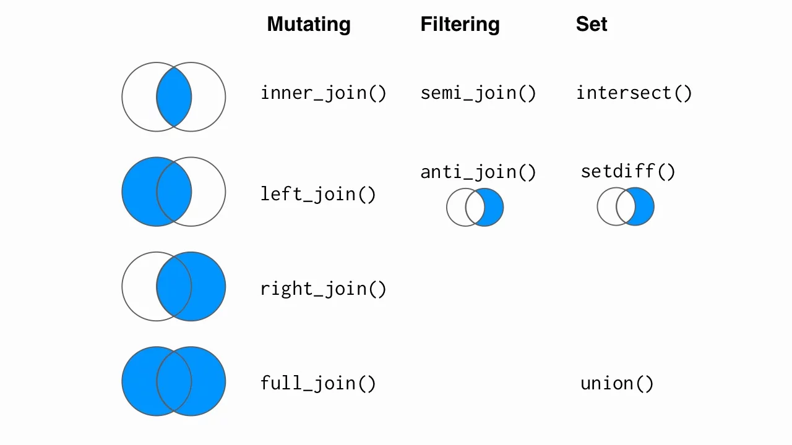

```{r setup, include=FALSE}
options(htmltools.dir.version = FALSE)
options(htmltools.preserve.raw = FALSE)
options(ggrepel.max.overlaps = Inf)

knitr::opts_chunk$set(echo = TRUE, 
                      dev = 'svg',
                      collapse = TRUE, 
                      comment = NA,  # PRINTS IN FRONT OF OUTPUT, default is '##' which comments out output
                      prompt = FALSE, # IF TRUE adds a > before each code input
                      warning = FALSE, 
                      message = FALSE,
                      fig.height = 3, 
                      fig.width = 4,
                      out.width = "100%",
                      prompt = FALSE
                      )

# load necessary packages
library(tidyverse)
library(dplyr)
library(countdown)
library(mosaic)
library(ggthemes)
library(xaringanExtra)
library(forcats)
xaringanExtra::use_panelset()
xaringanExtra::use_tachyons()
xaringanExtra::use_clipboard()
xaringanExtra::use_extra_styles(
  hover_code_line = TRUE,         
  mute_unhighlighted_code = TRUE  
)
library(flipbookr)
library(patchwork)
library(DT)
library(moderndive)
library(knitr)
library(grid)
library(gridExtra)
library(palmerpenguins)
library(broom)
library(ggResidpanel)
library(ggrepel)


# specific packages
library(maps)
library(maptools)
library(polite)
library(rvest)

select <- dplyr::select

# Set ggplot theme
# theme_set(theme_stata(base_size = 10))

yt <- 0

# read.csv("https://raw.githubusercontent.com/deepbas/statdatasets/main/agstrat.csv")


# data

polluted_cities <- tribble(
       ~city,   ~size, ~amount, 
  "New York", "large",      23,
  "New York", "small",      14,
    "London", "large",      22,
    "London", "small",      16,
   "Beijing", "large",      121,
   "Beijing", "small",      56
)


```


```{r xaringanExtra-clipboard, echo=FALSE}
htmltools::tagList(
  xaringanExtra::use_clipboard(
    button_text = "<i class=\"fa fa-clipboard\"></i>",
    success_text = "<i class=\"fa fa-check\" style=\"color: #90BE6D\"></i>",
    error_text = "<i class=\"fa fa-times-circle\" style=\"color: #F94144\"></i>"
  ),
  rmarkdown::html_dependency_font_awesome()
)
```


layout: true
  
---

class: title-slide, middle

# .fancy[More Data Wrangling]

### .fancy[Stat 220]

`r format(Sys.Date(), ' %B %d %Y')`

---


# Boolean operators

For help, `?base::Logic`

```{r echo=FALSE, out.width = "80%", fig.align='center'}
knitr::include_graphics("images/07-transform-logical.png")
```

.footnote[Source: *R for Data Science*, by Grolemund & Wickham]


---

class: middle

# `rename()` 

.pull-left[
```{r}
polluted_cities <- tribble(
       ~city,   ~size, ~amount, 
  "New York", "large",      23.4,
    "London", "large",      22.2,
    "Doha", "small",        12.4,
   "Hongkong", "small",      15.6,
   "Beijing", "large",      121.0,
)
```


```{r, highlight.output = c(2)}
polluted_cities %>% rename(quantity = amount)
```

]


.pull-right[
```{r}
polluted_cities <- tibble(
  city = c("New York", "London", "Doha",
           "Hongkong", "Beijing"),
  size = c("large", "large", "small",
           "small", "large"),
  amount = c(23.4, 22.2, 12.4, 
             15.6, 121.0)
)
```

```{r, highlight.output = c(2)}
polluted_cities %>% rename(pollution = amount)
```


]

---

class: middle

## Mutating multiple columns at once: `mutate_*`

.bq.font60[
- variants of `mutate()` that are useful for mutating multiple columns at once
  + `mutate_at()`, `mutate_if()`, `mutate_all()`, etc.

- which columns get mutated depends on a predicate, can be:
  + a function that returns TRUE/FALSE like `is.numeric()`
  + variable names through `vars()`
]

--

.pull-left.font80[

```{r}
polluted_cities %>% 
  mutate_at(vars(city:amount), toupper)
```
]

.pull-right.font80[
```{r}
polluted_cities %>% 
  mutate_if(is.double, round, digits = 0)
```

]

---

class: middle

# Selecting & renaming multiple columns

.bqt.font80[
- `select_*()` & `rename_*()` are variants of `select()` and `rename()`
- use like `mutate_*()` options on previous slide
]


---


class: action, middle

# <i class="fa fa-pencil-square-o" style="font-size:48px;color:purple">&nbsp;Group&nbsp;Activity&nbsp;`r (yt <- yt + 1)`</i>    


.pull-left-40[

]
.pull-right-60[
<br>
<br>

.bql.font80[
- Let's go over to [moodle](https://moodle.carleton.edu/course/view.php?id=43045)
- Get the class activity 7.Rmd file
- Work on problem 1
]

<br>


]


`r countdown(minutes = 10, seconds = 00, top = 0 , color_background = "inherit", padding = "3px 4px", font_size = "2em")`

---

<br>

<center>
 <br>
</center>

---

class: middle

# Two-table verbs

.bql.font70[
- `inner_join()` - Merge two datasets. Exclude all unmatched rows.

- `full_join()` - Merge two datasets. Keep all observations.

- `left_join()` - Merge two datasets. Keep all observations from the origin table.

- `right_join()` - Merge two datasets. Keep all observations from the destination table.

- `anti_join()` - Drops all observations in origin that have a match in destination table.
]


---

class: middle

# Mutating Joins


.hljs[Differ in their behavior when a match is not found]


.bql.font80[

- `left_join()`
    
- `right_join()`
    
- `inner_join()`
    
- `full_join()`

]

---


# *left_join()*

```{r}
df1 <- tibble(x = c(1, 2), y = 2:1)
df2 <- tibble(x = c(3, 1), a = 10, b = "a")
```


.pull-left[
```{r, echo=FALSE}
df1 %>% knitr::kable(type = "html", caption = "df1")
```

```{r, eval=FALSE}
df1 %>% left_join(df2)
```


```{r, echo=FALSE}
df1 %>% left_join(df2) %>% 
  knitr::kable(type = "html")
```


]


.pull-right[

```{r, echo=FALSE}
df2 %>% knitr::kable(type = "html", caption = "df2")
```


```{r, eval=FALSE}
df2 %>% left_join(df1)
```


```{r, echo=FALSE}
df2 %>% left_join(df1) %>% 
  knitr::kable(type = "html")
```

]


---
  
# *right_join()*

```{r}
df1 <- tibble(x = c(1, 2), y = 2:1)
df2 <- tibble(x = c(3, 1), a = 10, b = "a")
```

.pull-left[

```{r, echo=FALSE}
df1 %>% knitr::kable(type = "html", caption = "df1")
```


```{r, eval=FALSE}
df1 %>% right_join(df2)
```


```{r, echo=FALSE}
df1 %>% right_join(df2) %>% 
  knitr::kable(type = "html")
```

]

.pull-right[

```{r, echo=FALSE}
df2 %>% knitr::kable(type = "html", caption = "df2")
```


```{r, eval=FALSE}
df2 %>% right_join(df1)
```

```{r, echo=FALSE}
df2 %>% right_join(df1) %>% 
  knitr::kable(type = "html")
```

]

---

# *inner_join()*

```{r}
df1 <- tibble(x = c(1, 2), y = 2:1)
df2 <- tibble(x = c(3, 1), a = 10, b = "a")
```

.pull-left[
```{r, echo=FALSE}
df1 %>% knitr::kable(caption = "df1")
```
]
.pull-right[
```{r, echo=FALSE}
df2 %>% knitr::kable(caption = "df2")
```
]

<br>

```{r, eval=FALSE}
df1 %>% inner_join(df2)
```

```{r, echo=FALSE}
df1 %>% inner_join(df2) %>% knitr::kable()
```


---

<br>
<br>
<br>

# Flights data

```{r}
library(nycflights13)
flights2 <- flights %>% 
  select(year:day, hour, origin, dest, tailnum, carrier)
```

--


```{r}
head(flights2)
```

---

class: middle

# Airline information

```{r}
head(airlines)
```

---

class: middle

# *left_join()*

```{r}
flights2 %>% 
  left_join(airlines)
```

---

class: middle

# Planes information

```{r}
head(planes)
```


---

class: middle

# Keys: controlling how the tables are matched

```{r}
flights2 %>% left_join(planes, by = "tailnum")
```

---

class: middle

# Matching keys


```{r}
flights2 %>% left_join(airports, by = c("origin" = "faa"))
```


---


class: middle
  
# Filtering joins

.hljs[most useful for diagnosing join mismatches]

.bql.font80[

Filtering joins return a copy of the dataset that has been filtered, not augmented (as with mutating joins)

- `semi_join(x,y)` :  keeps all observations in x that have a match in y.

- `anti_join(x,y)` :  drops all observations in x that have a match in y.

]


---


# Another example: *semi_join()*


```{r, echo=FALSE}
df1 <- tibble(x = c(1, 1, 3, 4), y = 1:4)
df2 <- tibble(x = c(1, 1, 2), z = c("a", "b", "a"))
```


.pull-left[
```{r, echo=FALSE}
df1 %>% knitr::kable(type = "html", caption = "df1")
```

```{r, eval=FALSE}
df1 %>% semi_join(df2, by = "x")
```

```{r, echo=FALSE}
df1 %>% semi_join(df2, by = "x") %>% knitr::kable(type = "html")
```

]
.pull-right[
```{r, echo=FALSE}
df2 %>% knitr::kable(type = "html", caption = "df2")
```

<br>

```{r, eval=FALSE}
df2 %>% semi_join(df1, by = "x")
```

```{r, echo=FALSE}
df2 %>% semi_join(df1, by = "x") %>% knitr::kable(type = "html")
```

]


---

# Another example: *anti_join()*

.pull-left[
```{r, echo=FALSE}
df1 %>% knitr::kable(type = "html", caption = "df1")
```

```{r, eval=FALSE}
df1 %>% anti_join(df2, by = "x")
```

```{r, echo=FALSE}
df1 %>% anti_join(df2, by = "x") %>% knitr::kable(type = "html")
```

]
.pull-right[
```{r, echo=FALSE}
df2 %>% knitr::kable(type = "html", caption = "df2")
```

<br>

```{r, eval=FALSE}
df2 %>% anti_join(df1, by = "x")
```

```{r, echo=FALSE}
df2 %>% anti_join(df1, by = "x") %>% knitr::kable(type = "html")
```

]

---

# Set Operations

.font90.hljs[These expect the x and y inputs to have the same variables, and treat the observations like sets:]

.bql.font80[
- `intersect(x,y)`
  - will return only the rows that appear in both datasets

- `union(x,y)` 
  - return every row that appears in one or more of the datasets
  - If a row appears multiple times union will only return it once

- `setdiff(x,y)`
  - will return the rows that appear in the first dataset but not the second
]

---

### Set operations

```{r, echo=FALSE}
df1 <- tibble(x = 1:2, y = c(1,1))
df2 <- tibble(x = 1:2, y = 1:2)

```


.pull-left.code70[
```{r, echo=FALSE}
df1 <- tibble(x = 1:2, y = c(1,1))
```

```{r, echo=FALSE}
df1 %>% knitr::kable(type = "html", caption = "df1")
```

```{r, eval=FALSE}
intersect(df1, df2))
```

```{r, echo=FALSE}
intersect(df1, df2) %>% knitr::kable(type = "html")
```


```{r, eval=FALSE}
setdiff(df1, df2))
```

```{r, echo=FALSE}
setdiff(df1, df2) %>% knitr::kable(type = "html")
```

]
.pull-right.font70[

```{r, echo=FALSE}
df2 <- tibble(x = 1:2, y = 1:2)
```

```{r, echo=FALSE}
df2 %>% knitr::kable(type = "html", caption = "df2")
```


```{r, eval=FALSE}
union(df1, df2))
```

```{r, echo=FALSE}
union(df1, df2) %>% knitr::kable(type = "html")
```

```{r, eval=FALSE}
setdiff(df2, df1))
```

```{r, echo=FALSE}
setdiff(df2, df1) %>% knitr::kable(type = "html")
```

]

---

class: action, middle

# <i class="fa fa-pencil-square-o" style="font-size:48px;color:purple">&nbsp;Group&nbsp;Activity&nbsp;`r (yt <- yt + 1)`</i>    


.pull-left-40[

]
.pull-right-60[
<br>
<br>
.bql[
- Work on problems 2-3
- Ask me questions
]
]

`r countdown(minutes = 10, seconds = 00, top = 0 , color_background = "inherit", padding = "3px 4px", font_size = "2em")`


